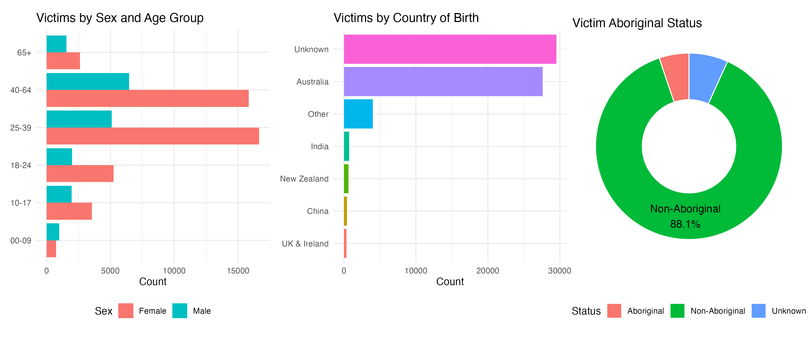
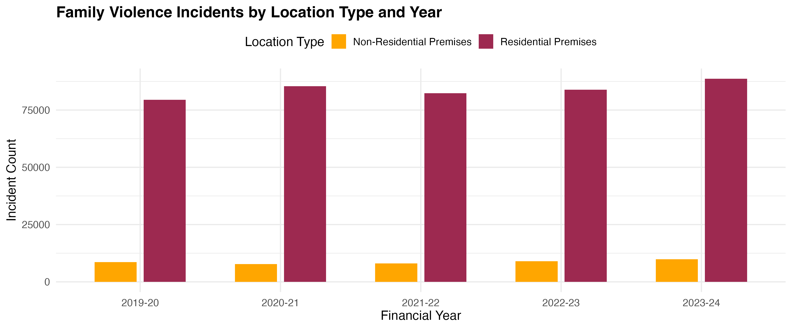
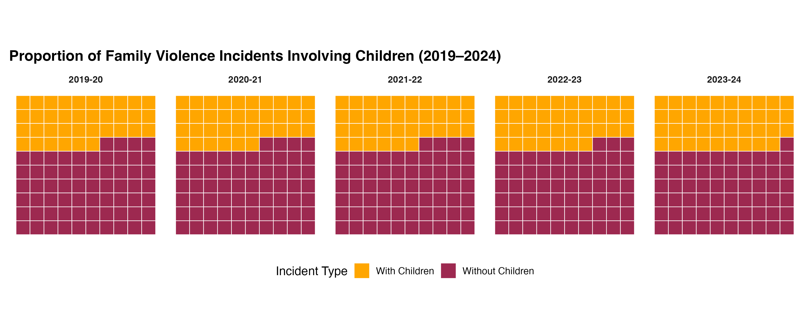

::: slide
## The Rising Tide
### Escalating Family Violence Across Police Regions

```{r}
# ============================================
# Load Required Packages
# ============================================
library(readxl)
library(tidyverse)
library(zoo)
library(plotly)

# ============================================
# Define File Path
# ============================================
file_path <- "data/Data by Local Government Area Tables 2024 15.20.51.xlsx"

# ============================================
# Helper: Read Standard LGA Tables (Table 1–3, 7, 16, 18, 19)
# ============================================
read_lga_table <- function(file, sheet_name, value_col_name, data_range) {
  col_names <- c("Police region", "DFFH region", "Local government area",
                 "2019-20", "2020-21", "2021-22", "2022-23", "2023-24")
  
  read_excel(file, sheet = sheet_name, range = data_range, col_names = col_names) %>%
    fill(`Police region`, `DFFH region`, .direction = "down") %>%
    mutate(across(`2019-20`:`2023-24`, ~ as.numeric(
      na_if(str_replace_all(as.character(.), "[^0-9\\.]", ""), "")
    ))) %>%
    pivot_longer(
      cols = `2019-20`:`2023-24`,
      names_to = "Financial year",
      values_to = value_col_name
    ) %>%
    mutate(across(c(`Police region`, `DFFH region`, `Local government area`, `Financial year`), as.character))
}

# ============================================
# Load Required Tables for Plotting
# ============================================
LGA_TB1_incident_count <- read_lga_table(file_path, "Table 1", "Incident count", "B15:I93")
LGA_TB2_incident_rate  <- read_lga_table(file_path, "Table 2", "Incident rate", "B15:I93")

# ============================================
# Step 1: Join both tables by common keys
# ============================================
incident_data <- LGA_TB1_incident_count %>%
  left_join(LGA_TB2_incident_rate,
            by = c("Police region", "DFFH region", "Local government area", "Financial year"))

# ============================================
# Step 2: Aggregate Incident Count and Avg Rate
# ============================================
summary_data <- incident_data %>%
  group_by(`Police region`, `Financial year`) %>%
  summarise(
    total_count = sum(`Incident count`, na.rm = TRUE),
    avg_rate = round(mean(`Incident rate`, na.rm = TRUE), 1),
    .groups = 'drop'
  )

# ============================================
# Step 3: Create Interactive Stacked Bar Plot
# ============================================
plot <- plot_ly(
  data = summary_data,
  x = ~`Financial year`,
  y = ~total_count,
  color = ~`Police region`,
  type = 'bar',
  text = ~paste0(
    "Police Region: ", `Police region`, "<br>",
    "Incidents: ", total_count, "<br>",
    "Avg. Rate: ", avg_rate, " per 100,000"
  ),
  hoverinfo = 'text'
) %>%
  layout(
    barmode = 'stack',
    title = 'Family Violence Incident Counts by Police Region',
    xaxis = list(title = "Financial Year"),
    yaxis = list(title = "Total Incident Count"),
    legend = list(title = list(text = "Police Region"))
  )

# ============================================
# Display the Plot
# ============================================

htmltools::div(class = "standard-plot", plot)
```

> Total recorded incidents rose steadily to nearly 100,000 per year.  
> Rates remain highest in **North West** and **Southern Metro** regions, pointing to **concentrated and growing risk**.

:::

::: slide
## Invisible Victims
### Disparities by Age, Gender, Origin, and Status

```{r}
# Load required libraries
library(readxl)
library(dplyr)
library(ggplot2)
library(tidyr)
library(scales)
library(patchwork)

file_path <- "data/Justice System Data Tables 2024.xlsx"

# --- 1. Victim Sex and Age Group ---
male_data <- read_excel(file_path, sheet = "Table 5", range = "C15:H20", col_names = FALSE)
female_data <- read_excel(file_path, sheet = "Table 5", range = "C21:H26", col_names = FALSE)

age_groups <- c("00-09", "10-17", "18-24", "25-39", "40-64", "65+")
male_values <- male_data[[6]]
female_values <- female_data[[6]]

sex_age_df <- data.frame(
  AgeGroup = rep(age_groups, 2),
  Count = c(male_values, female_values),
  Sex = rep(c("Male", "Female"), each = length(age_groups))
)

# --- 2. Victim Country of Birth ---
country_df <- read_excel(file_path, sheet = "Table 7", range = "B15:G21", col_names = FALSE)
country_birth_df <- country_df %>%
  select(Country = ...1, Count = ...6) %>%
  mutate(Country = factor(Country, levels = Country[order(Count)]))

# --- 3. Victim Aboriginal Status ---
aboriginal_df <- read_excel(file_path, sheet = "Table 8", range = "H15:H17", col_names = "Count")
aboriginal_df <- tibble(
  Status = c("Aboriginal", "Non-Aboriginal", "Unknown"),
  Count = aboriginal_df$Count
)


# === Donut Chart Label Filtering ===
aboriginal_df <- aboriginal_df %>%
  mutate(
    Percent = Count / sum(Count),
    Label = ifelse(Status == "Non-Aboriginal", paste0(Status, "\n", percent(Percent)), "")
  )
# ========== Plotting ==========

# === Plot 1: Victims by Sex and Age Group ===
plot1 <- ggplot(sex_age_df, aes(x = Count, y = AgeGroup, fill = Sex)) +
  geom_col(position = "dodge") +
  labs(title = "Victims by Sex and Age Group", x = "Count", y = NULL) +
  theme_minimal() +
  theme(legend.position = "bottom")

# === Plot 2: Victims by Country of Birth ===
plot2 <- ggplot(country_birth_df, aes(x = Country, y = Count, fill = Country)) +
  geom_col(show.legend = FALSE) +
  coord_flip() +
  labs(title = "Victims by Country of Birth", x = NULL, y = "Count") +
  theme_minimal()

# === Plot 3: Donut Chart with Label for Non-Aboriginal Only ===
plot3 <- ggplot(aboriginal_df, aes(x = 2, y = Count, fill = Status)) +
  geom_col(width = 1, color = "white") +
  coord_polar(theta = "y") +
  geom_text(aes(label = Label), position = position_stack(vjust = 0.5), size = 4, na.rm = TRUE) +
  xlim(0.5, 2.5) +
  labs(title = "Victim Aboriginal Status") +
  theme_void() +
  theme(legend.position = "bottom")

# === Combine Plots: Each Keeps Its Own Legend ===
final_plot <- plot1 + plot2 + plot3 + 
  plot_layout(ncol = 3)

ggsave("figures/invisible_victims.png", final_plot, width = 12, height = 5, dpi = 300)

# === Display Plot ===

```

> Most victims are women aged 25–39, but significant shares include children and migrants. Over 5% identify as Aboriginal, but underreporting is likely. Systems must serve diverse, often overlooked groups.

:::

::: slide
## Where Violence Lives
### Home as the Most Common Site of Harm

```{r}
# ============================================
# Load Required Packages
# ============================================
library(readxl)
library(dplyr)
library(tidyr)
library(ggplot2)
library(zoo)

# ============================================
# Define File Path
# ============================================
file_path <- "data/Data by Local Government Area Tables 2024 15.20.51.xlsx"

# ============================================
# Helper Function: Read Table 8 – Multi-header wide-to-long
# ============================================
read_lga_multiblock <- function(file, sheet, header_range, data_range, value_col = "Count", group_col = "Location", group_levels = NULL) {
  header_raw <- read_excel(file, sheet = sheet, range = header_range, col_names = FALSE)
  year_row   <- zoo::na.locf(as.character(header_raw[2, 4:ncol(header_raw)]))
  group_row  <- str_to_lower(str_replace_all(as.character(header_raw[3, 4:ncol(header_raw)]), "\\s+", "_"))
  final_colnames <- c("Police region", "DFFH region", "Local government area", paste0(year_row, "_", group_row))
  
  data_raw <- read_excel(file, sheet = sheet, range = data_range, col_names = FALSE)
  colnames(data_raw) <- final_colnames
  
  df <- data_raw %>%
    fill(`Police region`, `DFFH region`, .direction = "down") %>%
    mutate(across(starts_with("20"), ~ as.numeric(str_replace_all(as.character(.), "[^0-9\\.]", "")))) %>%
    pivot_longer(
      cols = starts_with("20"),
      names_to = c("Financial year", group_col),
      names_pattern = "^([0-9]{4}-[0-9]{2})_(.*)$",
      values_to = value_col
    ) %>%
    mutate(!!group_col := str_to_title(str_replace_all(.data[[group_col]], "_", " ")))
  
  if (!is.null(group_levels)) {
    df[[group_col]] <- factor(df[[group_col]], levels = group_levels)
  }
  
  df
}

# ============================================
# Load Table 8: Incident Location Data
# ============================================
LGA_TB8_incident_location <- read_lga_multiblock(
  file = file_path,
  sheet = "Table 8",
  header_range = "B13:N15",
  data_range = "B16:N94",
  value_col = "Incident count",
  group_col = "Location",
  group_levels = c("Residential Premises", "Non-Residential Premises")
)

# ============================================
# Prepare and clean the data
# ============================================
location_summary <- LGA_TB8_incident_location %>%
  mutate(
    Location = str_trim(as.character(Location)),
    `Financial year` = factor(`Financial year`, levels = c("2019-20", "2020-21", "2021-22", "2022-23", "2023-24"))
  ) %>%
  filter(Location %in% c("Residential Premises", "Non-Residential Premises")) %>%
  group_by(`Financial year`, Location) %>%
  summarise(
    IncidentCount = sum(`Incident count`, na.rm = TRUE),
    .groups = "drop"
  )

# ============================================
# Create grouped bar chart
# ============================================
slide3_plot <- ggplot(location_summary, aes(x = `Financial year`, y = IncidentCount, fill = Location)) +
  geom_col(position = position_dodge(width = 0.7), width = 0.6) +
  scale_fill_manual(
    values = c("Residential Premises" = "#9d2950", "Non-Residential Premises" = "#ffa600")
  ) +
  labs(
    title = "Family Violence Incidents by Location Type and Year",
    x = "Financial Year",
    y = "Incident Count",
    fill = "Location Type"
  ) +
  theme_minimal(base_size = 14) +
  theme(
    plot.title = element_text(face = "bold", hjust = 0),
    axis.text.x = element_text(angle = 0, vjust = 0.5),
    legend.position = "top"
  )

ggsave("figures/homes.png", slide3_plot, width = 12, height = 5, dpi = 300)

# === Display Plot ===

```

> Over 80% of family violence incidents occur at residential premises—home is not safe for many victims, and this has remained consistent over five years.

:::

::: slide
## Children at Risk
### One in Four Incidents Involve Children

```{r}
# ============================================
# Load Required Libraries
# ============================================
library(readxl)
library(tidyverse)
library(scales)
library(zoo)
library(patchwork)

# ============================================
# Define File Path
# ============================================
file_path <- "data/Data by Local Government Area Tables 2024 15.20.51.xlsx"

# ============================================
# Helper: Read Standard LGA Tables
# ============================================
read_lga_table <- function(file, sheet_name, value_col_name, data_range) {
  col_names <- c("Police region", "DFFH region", "Local government area",
                 "2019-20", "2020-21", "2021-22", "2022-23", "2023-24")
  
  read_excel(file, sheet = sheet_name, range = data_range, col_names = col_names) %>%
    fill(`Police region`, `DFFH region`, .direction = "down") %>%
    mutate(across(`2019-20`:`2023-24`, ~ as.numeric(
      na_if(str_replace_all(as.character(.), "[^0-9\\.]", ""), "")
    ))) %>%
    pivot_longer(
      cols = `2019-20`:`2023-24`,
      names_to = "Financial year",
      values_to = value_col_name
    ) %>%
    mutate(across(c(`Police region`, `DFFH region`, `Local government area`, `Financial year`), as.character))
}

# ============================================
# Load Tables 1 and 7
# ============================================
LGA_TB1_incident_count     <- read_lga_table(file_path, "Table 1", "Incident count", "B15:I93")
LGA_TB7_children_incidents <- read_lga_table(file_path, "Table 7", "Incident count", "B15:I93")

# ============================================
# Step 1: Summarise Total and Child-Involved Incidents
# ============================================
total_by_year <- LGA_TB1_incident_count %>%
  group_by(`Financial year`) %>%
  summarise(Total = sum(`Incident count`, na.rm = TRUE), .groups = "drop")

child_by_year <- LGA_TB7_children_incidents %>%
  group_by(`Financial year`) %>%
  summarise(WithChildren = sum(`Incident count`, na.rm = TRUE), .groups = "drop")

# ============================================
# Step 2: Merge and Prepare Grid for Waffle
# ============================================
waffle_df <- left_join(total_by_year, child_by_year, by = "Financial year") %>%
  mutate(
    WithoutChildren = Total - WithChildren,
    `With Children` = round((WithChildren / Total) * 100),
    `Without Children` = 100 - `With Children`
  ) %>%
  select(`Financial year`, `With Children`, `Without Children`) %>%
  pivot_longer(-`Financial year`, names_to = "Type", values_to = "Percent") %>%
  uncount(weights = Percent) %>%
  group_by(`Financial year`, Type) %>%
  mutate(id = row_number()) %>%
  ungroup() %>%
  group_by(`Financial year`) %>%
  mutate(
    x = (row_number() - 1) %% 10,
    y = -((row_number() - 1) %/% 10)
  ) %>%
  ungroup() %>%
  mutate(Type = factor(Type, levels = c("With Children", "Without Children")))

# ============================================
# Step 3: Plot Waffle Chart
# ============================================
child_waffle <- ggplot(waffle_df, aes(x = x, y = y, fill = Type)) +
  geom_tile(color = "white", size = 0.3) +
  facet_wrap(~`Financial year`, nrow = 1) +
  coord_equal() +
  scale_fill_manual(values = c("With Children" = "#ffa600", "Without Children" = "#9d2950")) +
  labs(
    title = "Proportion of Family Violence Incidents Involving Children (2019–2024)",
    fill = "Incident Type"
  ) +
  theme_minimal(base_size = 13) +
  theme(
    axis.text = element_blank(),
    axis.title = element_blank(),
    panel.grid = element_blank(),
    strip.text = element_text(size = 10, face = "bold"),
    legend.position = "bottom",
    plot.title = element_text(face = "bold", hjust = 0)
  )

# ============================================
# Display
# ============================================
ggsave("figures/child_waffle.png", child_waffle, width = 12, height = 5, dpi = 300)

# === Display Plot ===

```

> Waffle plots show that more than 25% of family violence incidents involve children—exposing them to direct harm and long-term trauma.

:::

::: slide
## The Protection Gap
### Tracking the Flow of Justice System Responses

```{r}
library(readxl)
library(dplyr)
library(networkD3)
library(stringr)
library(htmltools)

# === Helper function to clean and convert text numbers ===
extract_numeric <- function(x) {
  x <- str_remove_all(x, ",")
  x <- str_extract(x, "\\d+(\\.\\d+)?")
  as.numeric(x)
}

# === Load raw data ===
file_path <- "data/Justice System Data Tables 2024.xlsx"
table1_raw <- read_excel(file_path, sheet = "Table 1", range = "G15:G22", col_names = FALSE)
table2_raw <- read_excel(file_path, sheet = "Table 2", range = "G16:G18", col_names = FALSE)

# === Extract and clean numeric values ===
table1 <- sapply(table1_raw[[1]], extract_numeric)
table2 <- sapply(table2_raw[[1]], extract_numeric)

# === Assign values ===
fv_incidents <- table1[1]
offense_recorded <- table1[2]
offender_charged <- table1[3]
case_heard <- table1[4]
custody <- table1[5]
community <- table1[6]
other_outcome <- table1[7]
not_proven <- table1[8]

fvsn_issued <- table2[1]
fvio_app <- table2[2]
fvio_issued <- table2[3]

# === Derived values ===
offense_not_recorded <- fv_incidents - offense_recorded
fvsn_not_issued <- fv_incidents - fvsn_issued
offender_not_charged <- offense_recorded - offender_charged
case_not_heard <- offender_charged - case_heard
fvio_not_issued <- fvio_app - fvio_issued

# === Define nodes with counts ===
node_labels <- c(
  sprintf("FV Incidents\\n(%s)", fv_incidents),
  sprintf("Offense Recorded\\n(%s)", offense_recorded),
  sprintf("Offense Not Recorded\\n(%s)", offense_not_recorded),
  sprintf("FVSN Issued\\n(%s)", fvsn_issued),
  sprintf("FVSN Not Issued\\n(%s)", fvsn_not_issued),
  sprintf("Offender Charged\\n(%s)", offender_charged),
  sprintf("Offender Not Charged\\n(%s)", offender_not_charged),
  sprintf("New FVIO Application\\n(%s)", fvio_app),
  sprintf("Case Heard in Court\\n(%s)", case_heard),
  sprintf("Case Not Heard in Court\\n(%s)", case_not_heard),
  sprintf("New FVIO Issued\\n(%s)", fvio_issued),
  sprintf("New FVIO Not Issued\\n(%s)", fvio_not_issued),
  sprintf("Charge Proven - Custody\\n(%s)", custody),
  sprintf("Charge Proven - Community\\n(%s)", community),
  sprintf("Charge Proven - Other\\n(%s)", other_outcome),
  sprintf("Charge Not Proven\\n(%s)", not_proven)
)
nodes <- data.frame(name = factor(node_labels))

# === Define links ===
links <- data.frame(
  source = c(0, 0, 0, 0, 1, 1, 3, 4, 5, 5, 7, 7, 8, 8, 8, 8),
  target = c(1, 2, 3, 4, 5, 6, 7, 7, 8, 9, 10, 11, 12, 13, 14, 15),
  value = c(
    offense_recorded, offense_not_recorded, fvsn_issued, fvsn_not_issued,
    offender_charged, offender_not_charged,
    fvsn_issued, fvsn_not_issued,
    case_heard, case_not_heard,
    fvio_issued, fvio_not_issued,
    custody, community, other_outcome, not_proven
  )
)

# === Color palette for nodes (matching theme) ===
node_color <- c(
  rep("#9d2950", 5),
  rep("#c75d7c", 2),
  "#9d2950", "#e3a1b4",
  rep("#d4849c", 2),
  "#9d2950", "#f0c3ce",
  "#a01f44", "#ba476d", "#d47a9b", "#f4b9cd"
)
colour_scale <- paste0("d3.scaleOrdinal().range([\"", paste(node_color, collapse = '", "'), "\"])")

# === Draw Sankey ===
htmltools::div(
  style = "width: 100%; height: auto;",
  sankeyNetwork(
    Links = links, Nodes = nodes,
    Source = "source", Target = "target",
    Value = "value", NodeID = "name",
    fontSize = 13, nodeWidth = 30,
    sinksRight = FALSE,
    colourScale = colour_scale
  )
)
```

> This funnel shows systemic attrition. Many incidents don’t lead to charges or protection orders. Even when applications are made, final intervention is not guaranteed.

:::

:::::: slide
## When Protection Fails
### The Human Cost of Inaction

```{r}
library(readxl)
library(dplyr)
library(tidyr)
library(plotly)
library(stringr)

file_path <- "data/Justice System Data Tables 2024.xlsx"

# --- Plot 1: FV-Related Homicide Incidents Over 5 Years ---
incident_data <- read_excel(file_path, sheet = "Table 21", range = "B15:G17", col_names = FALSE)
colnames(incident_data) <- c("Type", "2019-20", "2020-21", "2021-22", "2022-23", "2023-24")

incident_data <- incident_data %>%
  mutate(across(`2019-20`:`2023-24`, ~ as.numeric(str_replace(., "\u2264\\s*3", "3"))))

fv_incidents <- incident_data %>%
  filter(Type == "Family violence-related") %>%
  pivot_longer(-Type, names_to = "Year", values_to = "Count")

plot1 <- plot_ly(fv_incidents, x = ~Year, y = ~Count, type = "bar") %>%
  layout(
    title = "Family Violence Homicide Incidents (2019–2024)",
    yaxis = list(title = "Incidents"),
    xaxis = list(title = "")
  )

# --- Plot 2: Mechanism of Death ---
mechanism_data <- read_excel(file_path, sheet = "Table 23", range = "B14:D20",
                             col_names = c("Mechanism", "Victims", "Percent")) %>%
  mutate(Percent = as.numeric(str_replace_all(Percent, c("," = ".", "%" = ""))) )

plot2 <- plot_ly(mechanism_data, x = ~Percent, y = ~Mechanism, type = "bar", orientation = "h",
                 text = ~paste0(Percent, "%"), textposition = "auto") %>%
  layout(
    title = "Mechanism of Death (% of FV Victims)",
    xaxis = list(title = "Percent"),
    yaxis = list(title = "")
  )

# --- Plot 3: Donut Chart of Victims by Sex ---
sex_data <- tibble(
  Sex = c("Male", "Female"),
  Victims = c(34, 63)
)

plot3 <- plot_ly(sex_data, labels = ~Sex, values = ~Victims, type = "pie", hole = 0.5,
                 textinfo = "label+percent") %>%
  layout(
    title = "Victims by Sex (FV Homicides)",
    showlegend = TRUE
  )

# --- Plot 4: Treemap of Female Victims by Relationship to Offender ---
relationship_data <- read_excel(file_path, sheet = "Table 28", range = "B14:E23",
                                col_names = c("Sex", "Relationship", "Victims", "Percent")) %>%
  fill(Sex, .direction = "down") %>%
  filter(Sex == "Female", Relationship != "Total") %>%
  mutate(Victims = as.numeric(str_replace(Victims, "\u2264\\s*3", "3")))

relationship_data <- relationship_data %>%
  mutate(
    ids = paste("Female", Relationship, sep = " / "),
    labels = Relationship,
    parents = "Female Victims"
  )

root_node <- tibble(
  ids = "Female Victims",
  labels = "Female Victims",
  parents = "",
  Victims = sum(relationship_data$Victims)
)

treemap_df <- bind_rows(
  root_node,
  relationship_data %>% select(ids, labels, parents, Victims)
)

plot4 <- plot_ly(
  data = treemap_df,
  type = "treemap",
  ids = ~ids,
  labels = ~labels,
  parents = ~parents,
  values = ~Victims,
  branchvalues = "total"
) %>%
  layout(title = "Female Victims by Relationship to Offender")
```

::::: {.columns height="400px" style="gap: 1rem;"}
::: {.column width="50%"}
```{r}
htmltools::div(class = "standard-plot", plot1)
```
:::

::: {.column width="50%"}
```{r}
htmltools::div(class = "standard-plot", plot2)
```
:::
:::::

::::: {.columns height="600px" style="gap: 1rem;"}
::: {.column width="50%"}
```{r}
htmltools::div(class = "standard-plot", plot3)
```
:::

::: {.column width="50%"}
```{r}
htmltools::div(class = "standard-plot", plot4)
```
:::
:::::

> Homicides remain a tragic endpoint. Two-thirds of victims are women, often killed by partners. Mechanisms of death and relationship data point to patterns we can prevent.

::::::

::::::: slide
## Falling Through the Gaps
### Declining Support Volumes in Housing & Health

```{r}
library(readxl)
library(tidyverse)

# Function to import either 25a or 25b
read_table25_subtable <- function(file, sheet_name, data_range, metric_label, value_col_name = "Count") {
  # Define column names explicitly
  col_names <- c("Service type", "2019-20", "2020-21", "2021-22", "2022-23", "2023-24")
  
  # Read the subtable
  data_raw <- read_excel(file, sheet = sheet_name, range = data_range, col_names = col_names)
  
  # Reshape and clean
  data_long <- data_raw %>%
    pivot_longer(
      cols = starts_with("20"),
      names_to = "Financial year",
      values_to = value_col_name
    ) %>%
    mutate(
      !!value_col_name := str_replace_all(as.character(.data[[value_col_name]]), "[^0-9\\.]", "") %>% as.numeric(),
      Metric = metric_label
    )
  
  return(data_long)
}

# File path
file_path <- "data/Service Sector Data Tables 2024_0.xlsx"

# Table 25a – Clients assisted
table25a <- read_table25_subtable(
  file = file_path,
  sheet_name = "Table 25",
  data_range = "B15:G17",
  metric_label = "Clients assisted"
)

# Table 25b – Support periods
table25b <- read_table25_subtable(
  file = file_path,
  sheet_name = "Table 25",
  data_range = "B23:G25",
  metric_label = "Support periods"
)

# Combine if needed
table25_combined <- bind_rows(table25a, table25b)
```

```{r}
# Load required packages
library(readxl)
library(tidyverse)
library(zoo)

# Generic function for Tables 26–29
read_service_sector_table <- function(file, sheet_name, header_range, data_range, 
                                      col2_name, value_col_name = "Count") {
  # Step 1: Read the 2-row header
  header_raw <- read_excel(file, sheet = sheet_name, range = header_range, col_names = FALSE)
  
  # Extract year row (row 2, columns D to H = 3:7)
  year_row <- header_raw[2, 3:7] %>%
    unlist() %>%
    as.character() %>%
    zoo::na.locf()
  
  dynamic_cols <- paste0("y_", year_row)
  final_colnames <- c("Service type", col2_name, dynamic_cols)
  
  # Step 2: Read data block
  data_raw <- read_excel(file, sheet = sheet_name, range = data_range, col_names = FALSE)
  colnames(data_raw) <- final_colnames
  
  # Step 3: Clean and reshape
  data_clean <- data_raw %>%
    fill(`Service type`, .direction = "down") %>%
    mutate(across(starts_with("y_"), as.character)) %>%  # Avoid type mismatch
    pivot_longer(
      cols = starts_with("y_"),
      names_to = "Financial year",
      names_prefix = "y_",
      values_to = value_col_name
    ) %>%
    mutate(
      `Financial year` = as.character(`Financial year`),
      !!value_col_name := case_when(
        str_detect(.data[[value_col_name]], "^≤\\s*3") ~ "3",
        TRUE ~ str_extract(.data[[value_col_name]], "^\\d+(,\\d{3})*|\\d+")
      ),
      !!value_col_name := str_replace_all(.data[[value_col_name]], ",", ""),
      !!value_col_name := as.numeric(.data[[value_col_name]])
    )
  
  return(data_clean)
}

# Define file path
file_path <- "data/Service Sector Data Tables 2024_0.xlsx"

# Table 26 – Reason for presenting
table26 <- read_service_sector_table(
  file = file_path,
  sheet_name = "Table 26",
  header_range = "B13:H14",
  data_range = "B15:H29",
  col2_name = "Reason for presenting"
)

# Table 27 – Service provided
table27 <- read_service_sector_table(
  file = file_path,
  sheet_name = "Table 27",
  header_range = "B13:H14",
  data_range = "B15:H44",
  col2_name = "Service provided"
)

# Table 28 – Length of time
table28 <- read_service_sector_table(
  file = file_path,
  sheet_name = "Table 28",
  header_range = "B13:H14",
  data_range = "B15:H32",
  col2_name = "Length of time"
)

# Table 29 – Reason for closure
table29 <- read_service_sector_table(
  file = file_path,
  sheet_name = "Table 29",
  header_range = "B13:H14",
  data_range = "B15:H41",
  col2_name = "Reason for closure"
)
```

```{r}
# Load required packages
library(readxl)
library(tidyverse)
library(zoo)

# Define file path
file_path <- "data/Service Sector Data Tables 2024_0.xlsx"

# Step 1: Read 3-row header block (B13:R15)
header_raw <- read_excel(file_path, sheet = "Table 30", range = "B13:R15", col_names = FALSE)

# Step 2: Define fixed column names
fixed_cols <- c("Service type", "Age group")

# Step 3: Extract year (row 2) and sex (row 3) labels from columns D to R (i.e. 3:17)
year_row <- header_raw[2, 3:17] %>% unlist() %>% as.character() %>% zoo::na.locf()
sex_row  <- header_raw[3, 3:17] %>% unlist() %>% as.character()

# Clean up sex labels (underscores for matching, lowercase)
sex_row <- str_replace_all(sex_row, "\\s+", "_") %>% str_to_lower()

# Step 4: Build full column names
dynamic_cols <- paste0(year_row, "_", sex_row)
final_colnames <- c(fixed_cols, dynamic_cols)

# Step 5: Read the actual data (B16:R31 = 17 columns)
data_raw <- read_excel(file_path, sheet = "Table 30", range = "B16:R31", col_names = FALSE)
stopifnot(length(final_colnames) == ncol(data_raw))  # Sanity check
colnames(data_raw) <- final_colnames

# Step 6: Clean and reshape
table30 <- data_raw %>%
  fill(`Service type`, .direction = "down") %>%
  mutate(across(starts_with("20"), as.character)) %>%
  mutate(across(starts_with("20"), ~ case_when(
    str_detect(., "^≤\\s*3") ~ "3",
    TRUE ~ str_extract(., "^\\d+(,\\d{3})*|\\d+")
  ))) %>%
  mutate(across(starts_with("20"), ~ str_replace_all(., ",", "") %>% as.numeric())) %>%
  pivot_longer(
    cols = starts_with("20"),
    names_to = c("Financial year", "Sex"),
    names_pattern = "^([0-9]{4}-[0-9]{2})_(.*)$",
    values_to = "Count"
  ) %>%
  mutate(
    `Sex` = str_replace_all(Sex, "_", " ") %>% str_to_title(),
    `Sex` = factor(Sex, levels = c("Male", "Female", "Other")),
    `Age group` = as.character(`Age group`)
  )
```

::::: {.columns height="600px"}
::: {.column width="33%"}
```{r echo=FALSE}
# Clients Assisted
htmltools::div(class = "standard-plot",
  plotly::plot_ly(
    data = table25_combined %>% filter(Metric == "Clients assisted"),
    x = ~`Financial year`, 
    y = ~Count, 
    color = ~`Service type`, 
    type = 'bar',
    showlegend = FALSE
  ) %>% plotly::layout(
    barmode = "group", 
    title = "Clients Assisted", 
    yaxis = list(title = "Clients"),
    hovermode = "x unified"
  )
)
```
:::

::: {.column width="33%"}
```{r echo=FALSE}
# Duration of Support
htmltools::div(class = "standard-plot",
  plotly::plot_ly(
    data = table28 %>% group_by(`Length of time`, `Financial year`) %>% summarise(Count = sum(Count), .groups = "drop"),
    x = ~`Financial year`, 
    y = ~Count, 
    color = ~`Length of time`, 
    type = 'bar',
    showlegend = FALSE
  ) %>% plotly::layout(
    barmode = "stack", 
    title = "Duration of Support", 
    yaxis = list(title = "Count"),
    hovermode = "x unified"
  )
)
```
:::

::: {.column width="33%"}
```{r echo=FALSE}
# Closure Reasons
htmltools::div(class = "standard-plot",
  plotly::plot_ly(
    data = table29 %>% group_by(`Reason for closure`, `Financial year`) %>% summarise(Count = sum(Count), .groups = "drop"),
    x = ~`Financial year`, 
    y = ~Count, 
    color = ~`Reason for closure`, 
    type = 'bar',
    showlegend = FALSE
  ) %>% plotly::layout(
    barmode = "stack", 
    title = "Closure Reasons", 
    yaxis = list(title = "Count"),
    hovermode = "x unified"
  )
)
```
:::
::::::

> Services are shrinking—not because demand is dropping, but due to strained capacity. Support periods are shorter and fewer people are being helped year-on-year.

:::::::

:::::: slide
## Missed Warnings
### Risk Scores, Red Flags, and Inaction

```{r setup, include=FALSE}
library(readxl)
library(tidyverse)
library(plotly)
library(htmltools)

file_path <- "data/Justice System Data Tables 2024.xlsx"
```

::::: {.columns style="display: flex; gap: 1rem; height: 600px;"}
::: {.column width="45%"}

```{r plot1}
# Risk Level Bar Chart (L0–L16)
risk_levels <- read_excel(file_path, sheet = "Table 29", range = "G15:G31", col_names = FALSE) %>% pull(1)
risk_levels_df <- tibble(
  Level = factor(paste0("L", 0:16), levels = paste0("L", 0:16)),
  Count = as.numeric(risk_levels)
)

htmltools::div(style = "width: 100%; height: 180px;",
  plot_ly(risk_levels_df, x = ~Level, y = ~Count, type = 'bar',
          marker = list(color = '#9d2950')) %>%
    layout(title = "Risk Assessment Levels (L0–L16)",
           xaxis = list(title = "", tickangle = -45),
           yaxis = list(title = "", zeroline = FALSE),
           margin = list(t = 30, b = 40),
           height = 180)
)
```

```{r plot2}
# Donut Chart: Future Violence Likelihood
future_likelihood <- read_excel(file_path, sheet = "Table 29", range = "G33", col_names = FALSE) %>% pull(1)
future_not_likely <- 98816 - future_likelihood

future_data <- tibble(
  Category = c("Likely", "Not Likely"),
  Count = c(future_likelihood, future_not_likely)
)

htmltools::div(style = "width: 100%; height: 180px;",
  plot_ly(future_data, labels = ~Category, values = ~Count, type = 'pie',
          textinfo = 'label+percent', hole = 0.5,
          marker = list(colors = c("#ffa600", "#9d2950")),
          text = ~paste(Category, "<br>", Count, "cases")) %>%
    layout(title = "Future Violence Likelihood", height = 180)
)
```

```{r plot3}
# Pie Chart: Contributing Factors
mh <- sum(read_excel(file_path, sheet = "Table 30", range = "H15:H18", col_names = FALSE) %>% pull(1), na.rm = TRUE)
drug <- sum(read_excel(file_path, sheet = "Table 30", range = "H19:H22", col_names = FALSE) %>% pull(1), na.rm = TRUE)
alcohol <- sum(read_excel(file_path, sheet = "Table 30", range = "H23:H26", col_names = FALSE) %>% pull(1), na.rm = TRUE)

factors_data <- tibble(
  Category = c("Mental Health", "Drug", "Alcohol"),
  Count = c(mh, drug, alcohol)
)

htmltools::div(style = "width: 100%; height: 180px;",
  plot_ly(factors_data, labels = ~Category, values = ~Count, type = 'pie',
          textinfo = 'label+percent',
          marker = list(colors = c("#ffa600", "#ff6361", "#9d2950")),
          text = ~paste(Category, "<br>", Count, "cases")) %>%
    layout(title = "Contributing Factors", height = 180)
)
```
:::

::: {.column width="55%"}
```{r plot4}
# Risk Factors with overflow labels and text outside bars
risk_factors <- read_excel(file_path, sheet = "Table 31", range = "B15:G31", col_names = FALSE)
risk_factors_df <- tibble(
  Factor = risk_factors[[1]],
  Count = risk_factors[[6]]
)

htmltools::div(style = "width: 100%; height: 600px;",
  plot_ly(risk_factors_df, x = ~Count, y = ~reorder(Factor, Count), type = 'bar', orientation = 'h',
          text = ~paste(Factor, "<br>", Count, "cases"), textposition = 'outside',
          marker = list(color = '#d47a9b')) %>%
    layout(title = "Risk Factors (2023–24)",
           xaxis = list(title = "", zeroline = FALSE),
           yaxis = list(title = "", showticklabels = FALSE),
           margin = list(l = 10, r = 150),
           height = 600)
)
```
:::
:::::

> Thousands of L17 assessments indicate high risk. Many include mental health, drug, or alcohol factors—but these signals often fail to trigger effective response.

::::::

::: slide
## Toward Safer Futures

<p class="summary-paragraph">
Family violence in Victoria is not just widespread—it’s systemic, predictable, and preventable. The data reveals clear patterns: who is at risk, where protection breaks down, and where support is failing to reach. If we respond earlier, act on risk signals, and strengthen care beyond crisis points, we can stop violence before it escalates. <strong>Prevention is not a mystery—it’s a missed opportunity.</strong>
</p>

### <span class="accent">Key Takeaways from “Behind Closed Doors”</span>

<ul class="takeaway-list">
  <li><strong>Family violence is rising and geographically uneven</strong><br>
  Incident rates are highest in North West and Southern Metro regions, with annual cases nearing 100,000—showing persistent and localized crisis zones.</li>

  <li><strong>Victims are diverse—but not equally supported</strong><br>
  Women dominate victim profiles, but children, migrants, and Aboriginal Victorians are significantly impacted and often underserved in response systems.</li>

  <li><strong>Home remains the epicentre of violence</strong><br>
  Over 80% of incidents occur in residential settings, showing violence is most likely to happen where victims should feel safest.</li>

  <li><strong>Protective systems are leaky and incomplete</strong><br>
  Thousands of FVIOs are issued each year, yet large drop-offs occur at each stage—from offense recording to final court outcomes.</li>

  <li><strong>Support services are declining despite high risk</strong><br>
  Homelessness and health responses show shrinking service volumes—not because need is falling, but due to resource strain and limited capacity.</li>

  <li><strong>We have the data to prevent harm—but don’t act fast enough</strong><br>
  Risk assessments consistently flag danger, yet patterns repeat. Early intervention, cross-system tracking, and trauma-informed recovery are crucial next steps.</li>
</ul>

### References

<small>
Crime Statistics Agency. (2024). <em>Data by Local Government Area data tables 2024</em> [Data file]. https://www.crimestatistics.vic.gov.au<br>
Crime Statistics Agency. (2024). <em>Justice system data tables 2024</em> [Data file]. https://www.crimestatistics.vic.gov.au<br>
Crime Statistics Agency. (2024). <em>Service sector data tables 2024</em> [Data file]. https://www.crimestatistics.vic.gov.au
</small>
:::
